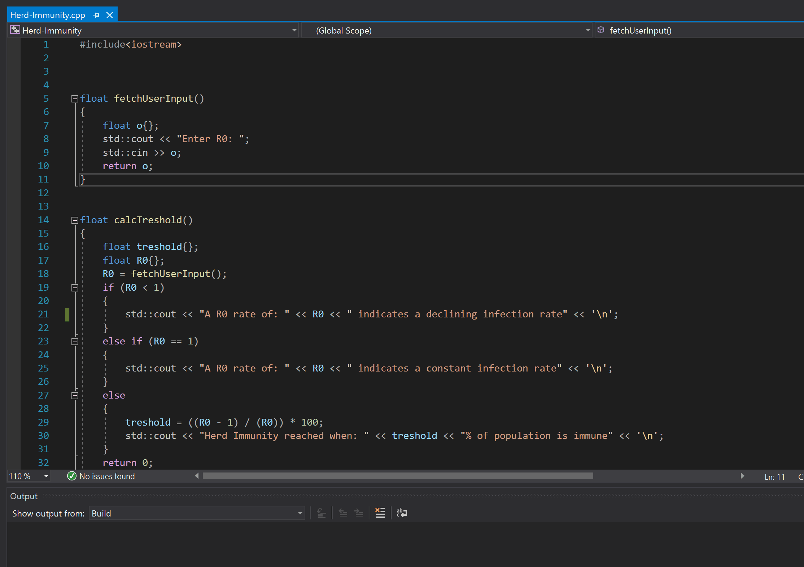

# Herd-Immunity-calculator
Simple calculator that calculates herd immunity threshold when given a R0 rate.

The calculator is based on the following formula:

(R0 − 1) / R0

where:

R0 = basic reproduction number: the number of individuals an infected person infects when the rest of the population is susceptible

The calculator will furthermore generate a number of general cases for a variety of R0 rates.

Refrences:

Paul Fine, Ken Eames, David L. Heymann, “Herd Immunity”: A Rough Guide, Clinical Infectious Diseases, Volume 52, Issue 7, 1 April 2011, Pages 911–916, https://doi.org/10.1093/cid/cir007

The following is an example for a R0 rate of 3:

