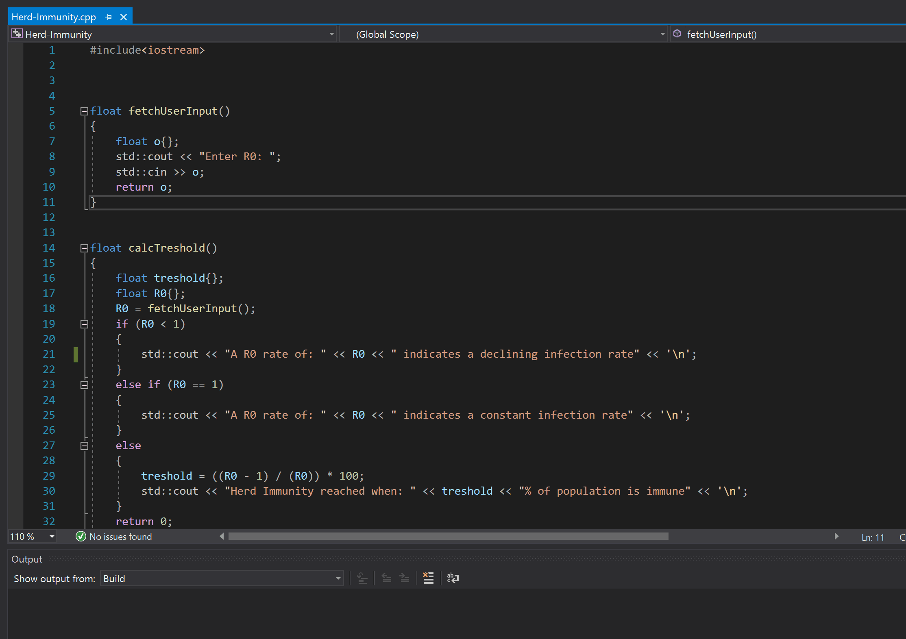

# Simple herd immunity calculator
Simple calculator that calculates herd immunity threshold when given a R0 rate.

The calculator is based on the following formula:

(R0 − 1) / R0

where:

R0 = basic reproduction number: the number of individuals an infected person infects when the rest of the population is susceptible

The calculator will furthermore generate a number of general cases for a variety of R0 rates.

References:

Paul Fine, Ken Eames, David L. Heymann, “Herd Immunity”: A Rough Guide, Clinical Infectious Diseases, Volume 52, Issue 7, 1 April 2011, Pages 911–916, https://doi.org/10.1093/cid/cir007

The following is an example for a R0 rate of 3:

# Buffon's needle problem

Buffon’s needle problem is known as one of the first Monte Carlo simulation ever conducted. The experiment set up was as follows:
- Floor divided by parallel lines with equal distances between them of b
- Dropping needles with length l bigger or equal b 
- Assumption: needle is thrown with uniform probability
- Question: what is the probability that needle hits a line?

Analytical solution:
Number of hits is given by the function: hit when: x < 0.5 cos(alpha), no-hit otherwise.
The variable x represents the centre of the needle and alpha is the angle between x and the closest line on the floor. Both, x and alpha follow a uniform distribution.
- Nhits = 2l / bπ
- xtip = xcentre – l / 2 * cos(alpha)
Furthermore, if a needle is equally long as the distance between the lines on the floor, we will have the probability of crossing equals 2 / π. (this equals 0.63663855 when π is estimated to be 3.1415)

Numerical result:
The code represents a simplified Monte Carlo simulation which throws virtually a needle many times over while counting hits if xtip is < 0. Finally, the numerical solution is estimated by dividing Nhits  by the total number of throws. Additionally, based on the resulting probability we can estimate π value by: 2 / probabilityestimated

References:
Theory of content:
Notes from my course: Methods and Data Analytics in Risk Assessment delivered by Christoph Feinauer, Fabrizio Pittorino, Enrico Malatesta at Bocconi University – Spring 2020

Uniform random number computation:

Scheinerman, E. (2006). 4. 2 Uniform random values. In E. Scheinerman, C++ for Mathematicians An Introduction for Students and Professionals (pp. 54-57). Boca Raton, FL: Chapman & Hall/CRC.

